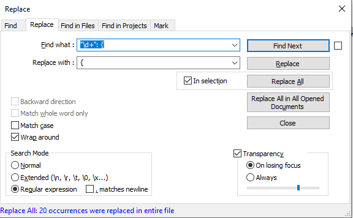

# Create dashboard by ARM template

```
az deployment group create --resource-group rg-nemedpet-dashboard --template-file dashboard_arm.json

## Fix the dashboard definition in JSON

Download the JSON definition from the existing dashboard. There are two things preventing bicep template from using it. It contains additional trailing characters and two values have incorrect data types.

The snippet of the JSON file exported from the dashboard.

```shell
"properties": {
      "lenses": {       <<< data type object
        "0": {          <<< trailing characters "0,1,2...":
          "order": 0,
          "parts": {    <<< data type object
            ...
            ...         <<< trailing characters "0,1,2...": in parts section
          }
        }
      },
      "metadata": {
```

First remove all trailing parts like "0": {, "1": { from the file by using Notepad++

```shell
"\d+": {
```



Second, change the data type of the value lenses and parts from the object to the list.

The example of a correct JSON structure.

```shell
  "properties": {
    "lenses": [         <<< data type list
      {        
        "order": 0,
        "parts": [      <<< data type list
          ...
          ...
        ]               <<< closing square brackets
      }
    ],                  <<< closing square brackets
    "metadata": {

```

The closing brackets can be found by one of those online JSON formatters i.e. https://jsonformatter.curiousconcept.com/


## Error message - Cannot deserialize the current JSON object

The deployment from the ARM template fails if the JSON file representing the dashboard exported from the portal is used without being re-formated.

```shell
{
  "code": "DeploymentFailed",
  "message": "At least one resource deployment operation failed. Please list deployment operations for details. Please see https://aka.ms/DeployOperations for usage details.",
  "details": [
    {
      "code": "37",
      "message": "The request content was invalid and could not be deserialized: 'Cannot deserialize the current JSON object (e.g. {\"name\":\"value\"}) into type 'System.Collections.Generic.List`1[Microsoft.WindowsAzure.ResourceStack.Providers.Feature.Definitions.V2020_09_01.DashboardLensDefinition_V2020_09_01]' because the type requires a JSON array (e.g. [1,2,3]) to deserialize correctly.\r\nTo fix this error either change the JSON to a JSON array (e.g. [1,2,3]) or change the deserialized type so that it is a normal .NET type (e.g. not a primitive type like integer, not a collection type like an array or List<T>) that can be deserialized from a JSON object. JsonObjectAttribute can also be added to the type to force it to deserialize from a JSON object.\r\nPath 'properties.lenses.0', line 1, position 97.'."
    }
  ]
}
```
