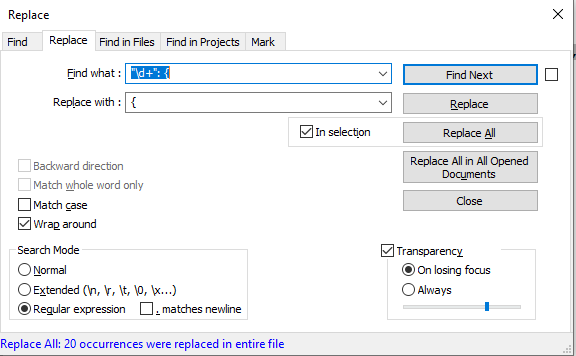
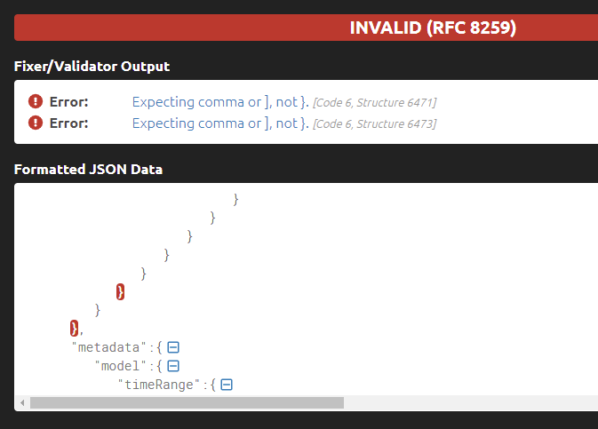

# Fix the dashboard definition in JSON

## Best practice

Download the dashboard definition in the JSON file formatted according top the API version you need.

```shell
armclient get https://management.azure.com/subscriptions/......../resourcegroups/......./providers/microsoft.portal/dashboards/.........?api-version=2020-09-01-preview > mydashboard.json
```

The file you download 

```json
{
  "properties": {
    "lenses": [
      {
        "order": 0,
        "parts": [
          {
            "position": {
              "x": 0,
              "y": 0,
              "rowSpan": 4,
              "colSpan": 6
            },
            ...
```

## Workaround

The JSON file definition has to be re-formatted to make it compliant with the API version 2020-09-01-preview and newer.

Download the JSON definition from the existing dashboard in portal. There is no option to choose in according to which API version the file should be formatted.
If it's in one of the older version then tThere are two things preventing ARM template using API 2020-09-01 and newer from using it. It contains additional trailing characters and two values have incorrect data types.

The snippet of the JSON file exported from the dashboard.

```shell
"properties": {
      "lenses": {       <<< data type object
        "0": {          <<< trailing characters "0,1,2...":
          "order": 0,
          "parts": {    <<< data type object
            ...
            ...         <<< trailing characters "0,1,2...": in parts section
          }
        }
      },
      "metadata": {
```

First remove all trailing parts like "0": {, "1": { from the file by using Notepad++

```shell
"\d+": {
```



Second, change the data type of the value lenses and parts from the object to the list.

The example of a correct JSON structure.

```shell
  "properties": {
    "lenses": [         <<< data type list
      {        
        "order": 0,
        "parts": [      <<< data type list
          ...
          ...
        ]               <<< closing square brackets
      }
    ],                  <<< closing square brackets
    "metadata": {

```

The closing brackets can be found by one of those online JSON formatters i.e. https://jsonformatter.curiousconcept.com/.



## Error message - Cannot deserialize the current JSON object

The deployment from the ARM template fails if the JSON file representing the dashboard exported from the portal is used without being re-formated.

```shell
{
  "code": "DeploymentFailed",
  "message": "At least one resource deployment operation failed. Please list deployment operations for details. Please see https://aka.ms/DeployOperations for usage details.",
  "details": [
    {
      "code": "37",
      "message": "The request content was invalid and could not be deserialized: 'Cannot deserialize the current JSON object (e.g. {\"name\":\"value\"}) into type 'System.Collections.Generic.List`1[Microsoft.WindowsAzure.ResourceStack.Providers.Feature.Definitions.V2020_09_01.DashboardLensDefinition_V2020_09_01]' because the type requires a JSON array (e.g. [1,2,3]) to deserialize correctly.\r\nTo fix this error either change the JSON to a JSON array (e.g. [1,2,3]) or change the deserialized type so that it is a normal .NET type (e.g. not a primitive type like integer, not a collection type like an array or List<T>) that can be deserialized from a JSON object. JsonObjectAttribute can also be added to the type to force it to deserialize from a JSON object.\r\nPath 'properties.lenses.0', line 1, position 97.'."
    }
  ]
}
```
