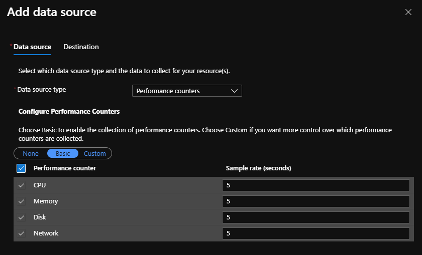
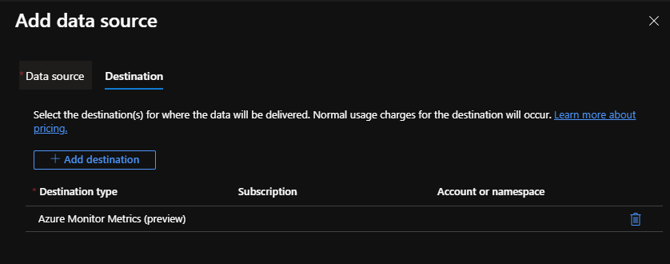
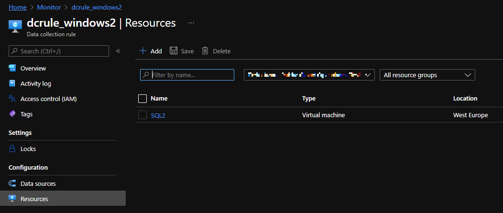

# Data Collection Rules

## Template description

The template creates a new data collection rule that's applied to a specified virtual machine.

## Prerequisite

There are no dependencies to other resources. The virtual machine is not a part of the ARM template and must be created in advance.

## Monitored Metrics

The rule created by the template activates the Basic metrics with sampling rate of 5 seconds.

Data are sent to only one destination which is Azure Metrics.

## Resources

The data collection rule is applied to the virtual machine which name is filled in as a parameter. The association is created as the resource type "Microsoft.Compute/virtualMachines/providers/dataCollectionRuleAssociations" and it is dependent on the rule that must exist at the time when the association is created. Choose any name that suit's your purpose. The name seems to be not visible in UI though.

