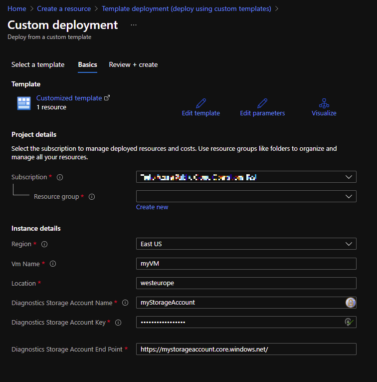

# Diagnostic settings

The template can be used to activate the custom performance metrics for a VM to be sent to Azure Monitor.

## Monitored metrics

In this example the virtual machine with one OS disk C: and a few Data disks D:, O:, P:, R: is monitored for various performance metrics to check if resources are not reaching their limits. The template can be customized to add or remove additional metrics supported by the VM.

## Prerequisites

- The storage account in which Diagnostic Logs should be saved. Guest-level monitoring can't be enabled without setting a storage account. See the note "*To get started now, choose a storage account below where diagnostic data will be sent and then click the button labeled 'Enable guest-level diagnostics'*."
  
  

- The storage account key.

- Existing virtual machine.

## Deployment

Choose the same resource group where the virtual machine in which the diagnostic settings is to be activated. Fill in information about the storage account name and end point into the parameters or update it in the ordering form.

&nbsp;&nbsp;&nbsp;&nbsp;