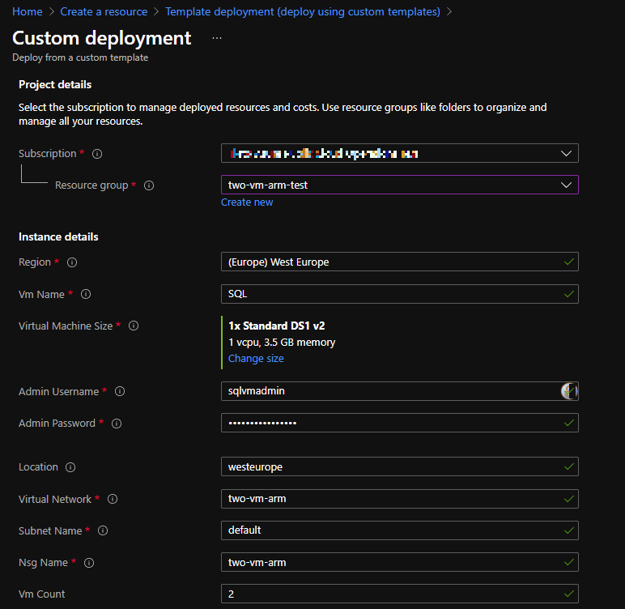

# Two same virtual machines in different zones

The template creates two identical VMs connected in two different availability zones connected to the same subnet.

## Prerequisite

- vNet
  
- Subnet

- Network Security Group

## Deployment

