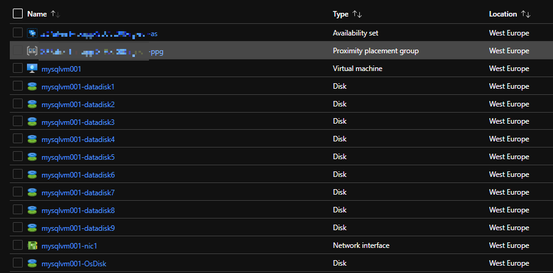
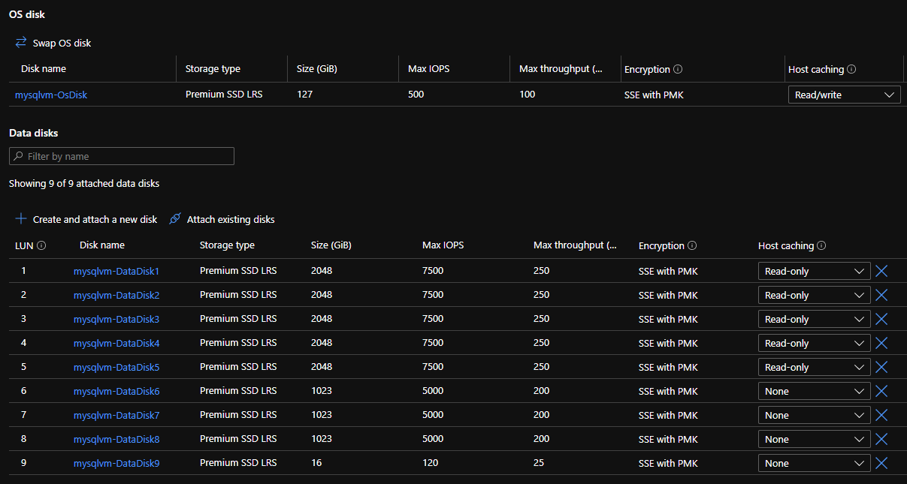
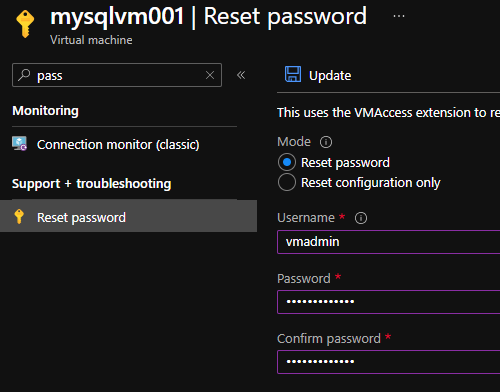

# Virtual Machine with multiple data disks

## Description

The template may be used for creating a virtual machine with multiple data disks. VM can have zero or several data disks. Each disk have their options (size, SKU etc.) and when you attach them you may also specify caching.
In this template as part of the virtual machine deployment three types of data disks are created:
- data disks
- log disks
- additional disks

Each type is represented with the parameters specifying number of disks, SKU, size and caching.

The virtual machine created by the template is supposed to be placed into a proximity placement group in an availability set that also may be created by template. Whether or not the availability set and proximity placement groups are created depends on the parameters createAvailabilitySet and createPpg. In such a way multiple VMs can be created while being put into the same proximity group and which can be further on used for forming clusters.

## Notice

The template can use the virtual network and subnet from different resource group.
If this is needed than add the following parameter into parameters. By default it takes the name of the RG where the resources are created.

```
    "networkRg": {
        "value": "mynetwork-rg"
    },
```

## Outcome

The template creates the following resources.




The virtual machine from the example shown below has been created with the size Standard_DS3_v2 and 5xP40, 3xP30 and 1xP3 data disks with Read only caching enabled for 5xP40.




## Password Reset

The user account created by template has unknown password generated by the function newGuid and it has to be reset.




## Additional information

The template has been created based on information shared in the following two posts and repositories.

- https://dev.to/omiossec/azure-how-to-build-a-reusable-multi-data-disks-vm-arm-template-2ghn

- https://github.com/OmegaMadLab/OptimizedSqlVm
